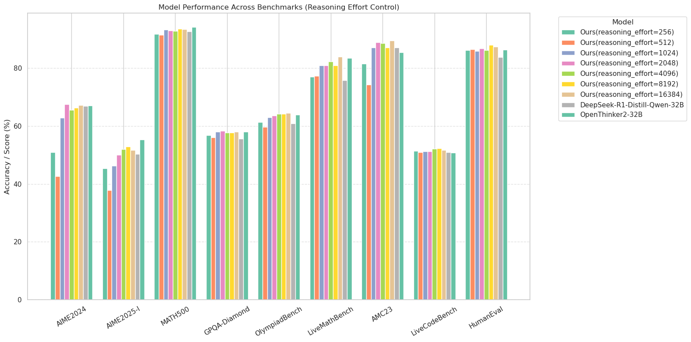
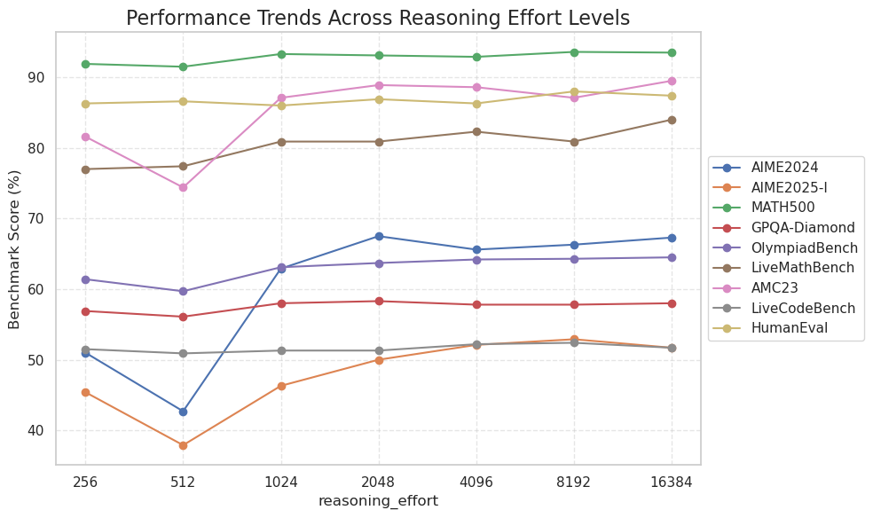
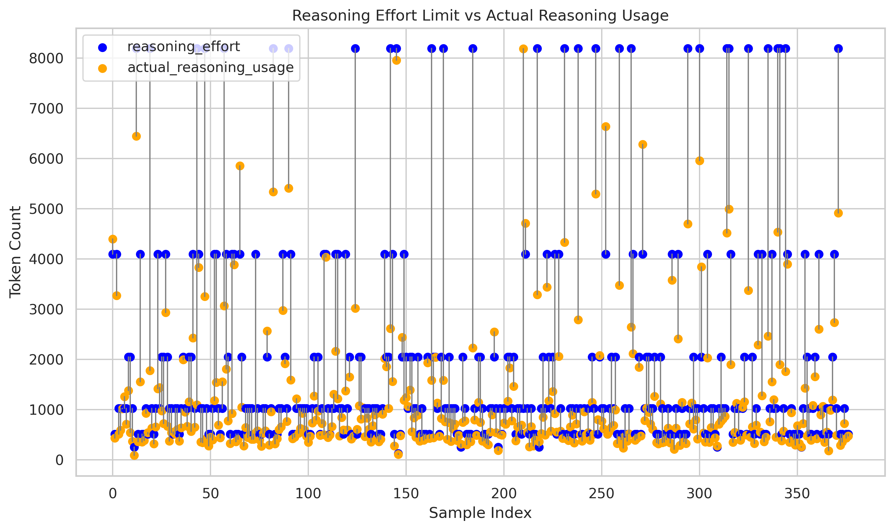

# 🧠 CRE-SFT: A Supervised Fine-Tuning Method for Controllable Reasoning Effort

English | [中文](README_zh.md)

This project introduces **CRE-SFT (Controllable Reasoning Effort SFT)**, a method that enables large language models to control the **length of reasoning** solely through **supervised fine-tuning (SFT)**. The model learns to adjust the depth of its reasoning process according to a contextual `reasoning_effort` value—producing concise or elaborate reasoning as needed.

The method is built on the [Qwen2.5-32B-Base](https://huggingface.co/Qwen/Qwen2.5-32B) pretrained model, trained on **1 million** supervised fine-tuning samples. It demonstrates not only effective adherence to different reasoning lengths but also successful transfer from short to long reasoning paradigms. With higher reasoning efforts, the model outperforms other models with similar parameter sizes across multiple evaluation benchmarks.

<div align="center">
  
</div>


## 📊 Method Overview

We define `reasoning_effort` as a value indicating the **upper limit of allowed reasoning length (in tokens)**. A higher value encourages more thorough reasoning and reflection. The following prompt is appended to each training sample after the original system prompt:

```
The reasoning_effort score is a measure of how verbose chain-of-thought reasoning before answering should be. Your reasoning can include logical deductions, evaluating possible interpretations, considering edge cases, and weighing tradeoffs between different response strategies.

Higher reasoning_effort scores indicate that more reasoning are expected, while lower reasoning_effort scores indicate that more concise reasoning are preferred. Overly verbose answers may be penalized when reasoning_effort is low, as will overly terse answers when reasoning_effort is high. 

Your reasoning_effort score is: {reasoning_effort}.
```

We observed that most training samples had a real reasoning length below 1k tokens. Code-related samples ranged from 2k–8k, with very few exceeding 16k. To normalize reasoning length, we defined a `next_power_of_two()` function to map token lengths into powers of two:

```python
def next_power_of_two(x: int) -> int:
    if x <= 0:
        return 0
    power = 1
    while power < x:
        power <<= 1
    return power
```

This function returns the **smallest power of two greater than or equal to a given positive integer `x`**, formally:

$$
f(x) =
\begin{cases}
0, & \text{if } x \leq 0 \\
2^{\lceil \log_2 x \rceil}, & \text{if } x > 0
\end{cases}
$$

Token length is calculated using the Qwen2.5-32B tokenizer:

```python
from transformers import AutoTokenizer

tokenizer = AutoTokenizer.from_pretrained("Qwen/Qwen2.5-32B", trust_remote_code=True)

def get_token_num(text):
    return len(tokenizer(text)["input_ids"])
```

Examples:

* Token length = 13 → `reasoning_effort` = 16
* Token length = 400 → `reasoning_effort` = 512

## 📂 Training Data

For samples with reasoning processes, the SFT data with prompt looks like:

```
<|im_start|>system
The reasoning_effort score is ...(omitted)
Your reasoning_effort score is: 256. <|im_end|>

<|im_start|>user
Which is greater, 9.11 or 9.2?<|im_end|>

<|im_start|>assistant
<think>
Let's compare 9.11 and 9.2. They have the same integer part (9), so we compare the decimal parts: 0.11 vs 0.2. We can write 0.2 as 0.20, and since 0.11 < 0.20, we conclude 9.11 < 9.2.
Also, the user might be referring to dates, but unless otherwise specified, we compare numerical values. So 9.2 is greater.
</think>
To compare 9.11 and 9.2:

1. **Integer part**: Both are 9, so we move to decimals.
2. **Decimal part**:
   - 9.11 → 0.11 (11/100)
   - 9.2 → 0.20 (2/10 = 20/100)
3. **Comparison**: 0.11 < 0.20, so 9.11 < 9.2.

**Conclusion**: 9.2 is greater.<|im_end|>
```

For samples **without reasoning**, the SFT format looks like:

```
<|im_start|>system
The reasoning_effort score is ...(omitted)
Your reasoning_effort score is: 0. <|im_end|>

<|im_start|>user
Hello<|im_end|>

<|im_start|>assistant
<think>
</think>
Hello! How can I help you today? Feel free to ask questions or chat!<|im_end|>
```

Data breakdown (1M total samples):

* Code tasks with reasoning: 40%
* Math tasks with reasoning: 40%
* General tasks with reasoning: 10%
* General tasks without reasoning: 10%

Training settings: 
* Full-parameter SFT
* Epoch = 2
* learning rate = 1e-5

## 📈 Experimental Results

Our model was evaluated across 9 public benchmarks with various `reasoning_effort` values, compared with two models of the same size: [DeepSeek-distill-Qwen-32B](https://huggingface.co/deepseek-ai/DeepSeek-R1-Distill-Qwen-32B) (based on Qwen2.5-32B-Base) and [OpenThinker2-32B](https://huggingface.co/open-thoughts/OpenThinker2-32B) (based on Qwen2.5-32B-Instruct).

| **Model**                  | **AIME2024** | **AIME2025-I** | **MATH500** | **GPQA-Diamond** | **OlympiadBench** | **LiveMathBench** | **AMC23** | **LiveCodeBench<br>[20240801-20250501]** | **HumanEval** | **Average** |
|:--------------------------:|:------------:|:--------------:|:-----------:|:----------------:|:-----------------:|:-----------------:|:---------:|:------------------------------------:|:-------------:|:-----------:|
| **DeepSeek-distill-Qwen-32B**     | 66.9         | 50.4     | 92.7        | 55.6             | 60.9              | 75.8              | 87.1      | 50.9                                | 83.8         | 70.44       |
| **OpenThinker2-32B<br>**              | 67.1         | **55.4** | **94.3**    | 58.1             | 63.9              | 83.6              | 85.5      | 50.8                                | 86.4         | 72.03       |
| **Ours<br>(reasoning_effort=256**)   | 51.0      | 45.4     | 91.9        | 56.9             | 61.4              | 77.0              | 81.6      | 51.5                                | 86.3         | 69.36       |
| **Ours<br>(reasoning_effort=512**)   | 42.7      | 37.9     | 91.5        | 56.1             | 59.7              | 77.4              | 74.4      | 50.9                                | 86.6         | 67.76       |
| **Ours<br>(reasoning_effort=1024**)  | 62.9      | 46.3     | 93.3        | 58.0             | 63.1              | 80.9              | 87.1      | 51.3                                | 86.0         | 71.15       |
| **Ours<br>(reasoning_effort=2048**)  | **67.5**  | 50.0     | 93.1        | **58.3**         | 63.7              | 80.9              | 88.9      | 51.3                                | 86.9         | 71.78       |
| **Ours<br>(reasoning_effort=4096**)  | 65.6      | 52.1     | 92.9        | 57.8             | 64.2              | 82.3              | 88.6      | 52.2                                | 86.3         | 71.86       |
| **Ours<br>(reasoning_effort=8192**)  | 66.3      | 52.9     | 93.6        | 57.8             | 64.3              | 80.9              | 87.1      | **52.4**                            | **88.0**     | 72.22       |
| **Ours<br>(reasoning_effort=16384**) | 67.3      | 51.7     | 93.5        | 58.0             | **64.5**          | **84.0**          | **89.5**  | 51.7                                | 87.4         | **72.25**   |

The results indicate a **positive correlation between reasoning effort and performance**. As `reasoning_effort` increases, the model provides deeper, more accurate reasoning. The best performance (72.25 average) occurs at `reasoning_effort=16384`.

<div align="center">
  
</div>

While increased reasoning effort improves performance, the **marginal benefit decreases** as the effort grows. Choosing the optimal value of `reasoning_effort` is crucial for balancing reasoning depth and response efficiency.

<div align="center">
  
</div>

We sampled over 300 test cases with target reasoning lengths under 8k and plotted the target vs actual reasoning lengths. The majority of cases stayed within the allowed limit, verifying the model’s ability to **control reasoning length** via discrete prompt signals.

## Limitations

* Reasoning granularity is coarse due to the use of power-of-two steps (e.g., 2k–4k, 4k–8k), which may lead to high variance in actual vs target lengths in mid ranges.
* Despite successful length control at higher values, the model tends to generate reasoning even when `reasoning_effort=0`, likely due to insufficient non-reasoning samples in the training data.
* When increasing `reasoning_effort` from 256 to 512, performance dropped on some benchmarks (e.g., AIME and AMC23), suggesting the model struggles to efficiently utilize medium-length reasoning budgets.

We will continue exploring finer-grained reasoning control and address the above limitations in future releases. Stay tuned for model checkpoints and accompanying papers.

## 📖 Example Usage

We demonstrate how changing the `reasoning_effort` controls the reasoning length:

* [reasoning\_effort=512](data/case_512.md)
* [reasoning\_effort=1024](data/case_1024.md)

Example request:

```bash
curl --location 'http://localhost:10001/v1/chat/completions' \
--header 'Content-Type: application/json' \
--data '{
    "model": "CRE-SFT",
    "messages": [
        {
            "role": "system",
            "content": "You are a helpful assistant.\n\nThe reasoning_effort score is a measure of how verbose chain-of-thought reasoning before answering should be. Your reasoning can include logical deductions, evaluating possible interpretations, considering edge cases, and weighing tradeoffs between different response strategies.\n\nHigher reasoning_effort scores indicate that more reasoning are expected, while lower reasoning_effort scores indicate that more concise reasoning are preferred. Overly verbose answers may be penalized when reasoning_effort is low, as will overly terse answers when reasoning_effort is high. \n\nYour reasoning_effort score is: 512."
        },
        {
            "role": "user",
            "content": "Introduce Newton’s laws of motion."
        }
    ],
    "temperature": 0.3,
    "stream": false
}'
```

## 📚 Citation

```
@misc{cre_sft,
  title={CRE-SFT: A Supervised Fine-Tuning Approach for Controllable Reasoning Effort},
  author={wenge-research},
  year={2025},
  url={https://github.com/wenge-research/CRE-SFT}
}
```
