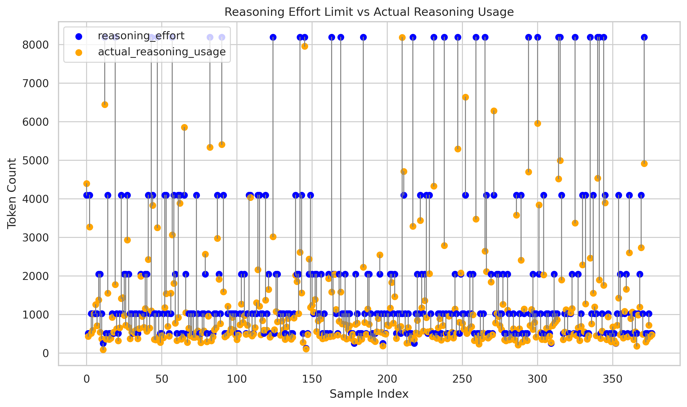

# 🧠 CRE-SFT: 一种可控思考长度的有监督微调方法

中文 | [English](README.md)


本项目提出了一种仅通过 **有监督微调（SFT）** 训练即可对深度思考大语言模型（即“推理模型”）的 **思考长度** 进行控制的方法 CRE-SFT (Controllable Reasoning Effort SFT)。该方法训练的模型能够根据任务上下文中的 `reasoning_effort` 值控制思考过程的长度，既能简洁推理，也可展开更深入的思考。

本项目基于 [Qwen2.5-32B-Base](https://huggingface.co/Qwen/Qwen2.5-32B) 预训练模型，在 **100万** 有监督微调数据上进行训练，验证了模型在多个任务中表现出对思考长度的遵循，以及表现出短思考训练数据到长思考范式的迁移。在较高思考长度时，模型在多个评测榜单的平均性能指标超过同等参数量模型。

<div align="center">
  
</div>


## 📊 方法介绍

我们定义了 `reasoning_effort`，表示回答中允许的思考长度（Token 数量）上限，值越高表示鼓励模型进行更长的思考和反思。每条训练数据都在其原始 system prompt 后面追加了如下提示词:

```
The reasoning_effort score is a measure of how verbose chain-of-thought reasoning before answering should be. Your reasoning can include logical deductions, evaluating possible interpretations, considering edge cases, and weighing tradeoffs between different response strategies.

Higher reasoning_effort scores indicate that more reasoning are expected, while lower reasoning_effort scores indicate that more concise reasoning are preferred. Overly verbose answers may be penalized when reasoning_effort is low, as will overly terse answers when reasoning_effort is high. 

Your reasoning_effort score is: {reasoning_effort}.
```


我们观察到，训练集里大部分数据的真实思考长度都在 1k 以内，代码类数据的思考长度分布在 2k~8k，而超过 16k 思考长度的数据较少。因此，我们定义了 `next_power_of_two()` 函数，将推理 token 长度映射到 2 的幂次空间：

```python
def next_power_of_two(x: int) -> int:
    if x <= 0:
        return 0
    power = 1
    while power < x:
        power <<= 1
    return power
```
函数 `next_power_of_two(x: int) -> int` 的作用是：**返回大于或等于给定正整数 `x` 的最小的 2 的幂**。即给定整数 $x \in \mathbb{Z}$，定义函数：

$$
f(x) =
\begin{cases}
0, & \text{if } x \leq 0 \\
2^{\lceil \log_2 x \rceil}, & \text{if } x > 0
\end{cases}
$$


* $\log_2 x$：以 2 为底的对数，表示 2 的多少次方等于 $x$。
* $\lceil \cdot \rceil$：向上取整函数，确保结果大于等于 $x$。

其中，思考过程 Token 数由 Qwen2.5-32B Tokenizer 计算得到。参考代码：

```python
from transformers import AutoTokenizer

tokenizer = AutoTokenizer.from_pretrained("Qwen/Qwen2.5-32B", trust_remote_code=True)

def get_token_num(text):
    return len(tokenizer(text)["input_ids"])
```    

例如：
- 思考长度 token = 13，转换为 reasoning_effort = 16
- 思考长度 token = 400，转换为 reasoning_effort = 512


## 📂 训练数据

对于包含思考过程的数据，拼接指令模版后的 SFT 训练数据示例如下：
```
<|im_start|>system
The reasoning_effort score is ...(omitted)
Your reasoning_effort score is: 256. <|im_end|>

<|im_start|>user
9.11和9.2谁更大？<|im_end|>

<|im_start|>assistant
<think>
嗯，用户问的是9.11和9.2哪个大。
比较小数的时候，整数部分相同的话，就比较小数部分。这里整数部分都是9，所以看小数部分。9.11的小数部分是0.11，而9.2的是0.2。接下来比较0.11和0.2哪个大。0.2可以看作0.20，这样0.11比0.20小，所以9.11比9.2小。
不过可能用户有其他的考虑，比如是否将9.11和9.2当作日期，但通常题目里如果没有特别说明，应该直接比较数值大小。所以答案应该是9.2更大。
</think>
9.11和9.2的大小比较可以通过以下步骤确定：

1. **整数部分比较**：两个数的整数部分都是9，因此需要进一步比较小数部分。
2. **小数部分比较**：
   - 9.11的小数部分是0.11（即11/100）。
   - 9.2的小数部分是0.20（即2/10，可视为20/100）。
3. **直接比较**：由于0.11 < 0.20，因此9.11 < 9.2。

**结论**：9.2比9.11大。<|im_end|>
```


对于不包含思考过程的数据，拼接指令模版后的 SFT 训练数据示例如下：
```
<|im_start|>system
The reasoning_effort score is ...(omitted)
Your reasoning_effort score is: 0. <|im_end|>

<|im_start|>user
你好<|im_end|>

<|im_start|>assistant
<think>
</think>
你好！有什么我能帮你的吗？无论是问题、建议还是闲聊，都可以随时告诉我哦！<|im_end|>
```

训练数据共计 100 万条，其中：
- 数据分布：
  - 包含思考过程的代码类任务：40%
  - 包含思考过程的数学类任务：40%
  - 包含思考过程的通用任务：10%
  - 无思考过程的通用任务：10%
- 超参数配置：
  - 全参数 SFT
  - Epoch = 2
  - lr = 1e-5

## 📈 实验分析

我们的模型在 AIME2024 等 9 个公开 benchmark 针对不同思考长度上限的配置进行测试，并对比了两个同等参数量模型 [DeepSeek-distill-Qwen-32B](https://huggingface.co/deepseek-ai/DeepSeek-R1-Distill-Qwen-32B) (基座模型为 Qwen2.5-32B-Base) 和 [OpenThinker2-32B](https://huggingface.co/open-thoughts/OpenThinker2-32B) (基座模型为 Qwen2.5-32B-Instruct)。

|               **Model**               | **Average** | **AIME2024** | **AIME2025-I** | **MATH500** | **GPQA-Diamond** | **OlympiadBench** | **LiveMathBench** | **AMC23** | **LiveCodeBench<br>\[20240801-20250501]** | **HumanEval** |
| :-----------------------------------: | :---------: | :----------: | :------------: | :---------: | :--------------: | :---------------: | :---------------: | :-------: | :---------------------------------------: | :-----------: |
|     **DeepSeek-distill-Qwen-32B**     |    70.44    |     66.9     |      50.4      |     92.7    |       55.6       |        60.9       |        75.8       |    87.1   |                    50.9                   |      83.8     |
|        **OpenThinker2-32B<br>**       |    72.03    |     67.1     |    **55.4**    |   **94.3**  |       58.1       |        63.9       |        83.6       |    85.5   |                    50.8                   |      86.4     |
|  **Ours<br>(reasoning\_effort=256**)  |    69.36    |     51.0     |      45.4      |     91.9    |       56.9       |        61.4       |        77.0       |    81.6   |                    51.5                   |      86.3     |
|  **Ours<br>(reasoning\_effort=512**)  |    67.76    |     42.7     |      37.9      |     91.5    |       56.1       |        59.7       |        77.4       |    74.4   |                    50.9                   |      86.6     |
|  **Ours<br>(reasoning\_effort=1024**) |    71.15    |     62.9     |      46.3      |     93.3    |       58.0       |        63.1       |        80.9       |    87.1   |                    51.3                   |      86.0     |
|  **Ours<br>(reasoning\_effort=2048**) |    71.78    |   **67.5**   |      50.0      |     93.1    |     **58.3**     |        63.7       |        80.9       |    88.9   |                    51.3                   |      86.9     |
|  **Ours<br>(reasoning\_effort=4096**) |    71.86    |     65.6     |      52.1      |     92.9    |       57.8       |        64.2       |        82.3       |    88.6   |                    52.2                   |      86.3     |
|  **Ours<br>(reasoning\_effort=8192**) |    72.22    |     66.3     |      52.9      |     93.6    |       57.8       |        64.3       |        80.9       |    87.1   |                  **52.4**                 |    **88.0**   |
| **Ours<br>(reasoning\_effort=16384**) |  **72.25**  |     67.3     |      51.7      |     93.5    |       58.0       |      **64.5**     |      **84.0**     |  **89.5** |                    51.7                   |      87.4     |


从以上表格中可以看到，**思考长度与模型能力呈现正相关**。随着 `reasoning_effort` 值的增加，模型在推理时展示出更多的细节和更高的准确度。当 `reasoning_effort=16384` 时，模型在多项任务上表现最佳，达到 72.25 分的最高 Average 分数。

<div align="center">
  
</div>

从上图中可以看到，尽管推理长度的增加通常会带来性能提升（如 `reasoning_effort=2048` 至 `reasoning_effort=16384`），但这种增益是逐步递减的，表明适当的推理长度可以达到较好的效果，而过度增大思考长度上限可能导致性能的边际效益递减。因此，选择合适的 `reasoning_effort` 值对于任务的优化至关重要。

<div align="center">
  
</div>

我们采样了 8k 以内思考长度的 300 余条测试数据，测试了每条数据的 `reasoning_effort`（蓝色点）及对应模型输出的真实思考长度（橙色点）。从上图中可以看到，绝大部分测试数据的真实思考长度都能够控制在 `reasoning_effort` 所限制的上限值以内，验证了通过离散数值的提示词注入能够引导模型产生一定的思考长度控制能力。

## 局限性

- 本实验中的粒度控制步长选择使用 2 的幂次，因此 2k~4k 以及 4k~8k 之间存在较大步长，这导致上述范围内思考长度控制不够精细化，`reasoning_effort` 和真实思考长度差值波动较大。  

- 尽管训练后的模型能够较好地实现思考长度上限控制（尤其是 >256 的思考长度），但我们发现，当 `reasoning_effort` 为 0 时，模型依然倾向于输出思考过程，这可能与无思考过程的通用训练数据量占比较少有关。

- 当 `reasoning_effort` 从 256 增加到 512，模型在数学奥赛相关数据集 AIME 和 AMC23 上的性能反而出现较大幅度下降，这可能是由于模型没有很好地学会如何有效利用这种中等长度的思考预算。

未来，我们会继续探索更细粒度的思考长度控制方法，深入分析上述局限性并给出具体的解决方案。相关模型和论文将在不久的将来陆续发布。敬请期待！

## 📖 测试样例

我们通过一个示例，演示通过改变 `reasoning_effort` 的值来控制思考长度上限。

- [reasoning_effort=512](data/case_512_zh.md)
- [reasoning_effort=1024](data/case_1024_zh.md)

请求示例：
```bash
curl --location 'http://localhost:10001/v1/chat/completions' \
--header 'Content-Type: application/json' \
--data '{
    "model": "CRE-SFT",
    "messages": [
        {
            "role": "system",
            "content": "You are a helpful assistant.\n\nThe reasoning_effort score is a measure of how verbose chain-of-thought reasoning before answering should be. Your reasoning can include logical deductions, evaluating possible interpretations, considering edge cases, and weighing tradeoffs between different response strategies.\n\nHigher reasoning_effort scores indicate that more reasoning are expected, while lower reasoning_effort scores indicate that more concise reasoning are preferred. Overly verbose answers may be penalized when reasoning_effort is low, as will overly terse answers when reasoning_effort is high. \n\nYour reasoning_effort score is: 512."
        },
        {
            "role": "user",
            "content": "介绍一下牛顿运动定律"
        }
    ],
    "temperature": 0.3,
    "stream": false
}'
```


## 📚 引用

```
@misc{cre_sft,
  title={CRE-SFT: A Supervised Fine-Tuning Approach for Controlling Reasoning Effort},
  author={wenge-research},
  year={2025},
  url={https://github.com/wenge-research/CRE-SFT}
}
```